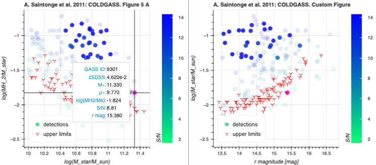

# Interactive-Data-Visualisation-with-Bokeh-for-Astronomers
Basic Bokeh tutorial presented at an ESO Chile Python Coffee. 

The focus is on the applications to the analysis of astronomical data.

The step by step tutorial for begginers is in the following jupyter notebook: [Basics_of_Bokeh_for_Astronomy.ipynb](Basics_of_Bokeh_for_Astronomy.ipynb)

Title: 
Interactive Data Visualisation with Bokeh: A Beginner’s Tutorial
 
Abstract:
Clear and interactive visualisations are a useful tool for data analysis, particularly for large and cross-correlated databases. Bokeh is a Python library that enables the creation of customised, interactive plots for the web (and for your personal notebooks), without requiring JavaScript. This tutorial introduces the fundamentals of Bokeh, focusing on how to build basic, interactive plots. Participants will learn how to work with Bokeh’s core components, such as figures, glyphs, layouts, and data sources, and will gain hands-on experience in creating dynamic dashboards. Participants are invited to discuss particular uses for their respective science cases.




### License and citation
Bokeh is BSD licensed, so you are free to use it however you like, as long as you copy the BSD statement if you redistribute the Bokeh source code (see [LICENSE.txt](https://github.com/bokeh/bokeh/blob/1.1.0/LICENSE.txt) for full details).

However, if you find Bokeh useful in your work, developers appreciate a citation.

To cite Bokeh in publications, use:
```
Bokeh Development Team (2018). Bokeh: Python library for interactive visualization
URL http://www.bokeh.pydata.org.
```
A BibTeX entry for LaTeX users is:

```
@Manual{,
title = {Bokeh: Python library for interactive visualization},
author = {{Bokeh Development Team}},
year = {2018},
url = {https://bokeh.pydata.org/en/latest/},
}
```
